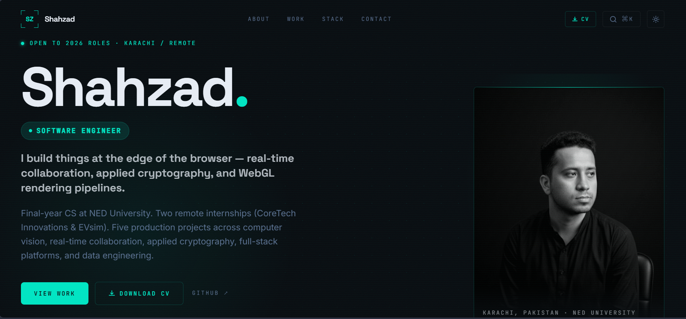

# Shahzad | Software Engineer Portfolio

<p align="center">
  
</p>

<p align="center">


</p>

<p align="center">
  A modern, high-performance developer portfolio showcasing full-stack projects, technical expertise, and software engineering experience.
</p>

<p align="center">
  <a href="https://portfolio-tan-alpha-36.vercel.app/"><strong>🌐 Live Demo</strong></a> •
  <a href="https://github.com/shehzadres"><strong>GitHub</strong></a> •
  <a href="mailto:shehzadres@gmail.com"><strong>Email</strong></a>
</p>

---

## Overview

This repository contains the source code for my personal portfolio website.

Designed with a strong emphasis on **performance**, **modern UI/UX**, and **developer experience**, the portfolio highlights my software engineering projects through detailed case studies rather than simple project cards.

The application is built with **TanStack Start**, **React 19**, and **Tailwind CSS v4**, featuring server-side rendering, smooth animations, responsive layouts, and an IDE-inspired visual design.

---

## Highlights

- Modern developer-focused interface
- Fully responsive across desktop, tablet, and mobile
- Interactive hero section
- Animated terminal component
- Project showcase with live demos and GitHub links
- Dedicated case study page for every project
- Command Palette (⌘K / Ctrl + K)
- Dark / Light theme
- Scroll-based animations
- SEO optimized
- Sitemap generation
- Server-side rendering (SSR)
- Cloudflare Workers deployment
- Fast page loads with Vite + Nitro

---

# Featured Projects

The portfolio currently showcases the following software projects.

| Project | Description |
|----------|-------------|
| **Visual Regex Builder** | Interactive visual regular expression builder with parser visualization, automata generation, and debugging workflow. |
| **Browser-Based Code IDE** | Collaborative browser IDE supporting real-time coding sessions and multiplayer editing. |
| **P2P Encrypted File Transfer** | Secure peer-to-peer file sharing using WebRTC with end-to-end encryption and zero server-side storage. |
| **Real-Time Collaborative Whiteboard** | Multi-user collaborative whiteboard supporting synchronized drawing and live interaction. |
| **3D Globe** | Interactive WebGL globe featuring immersive animations and geographical visualization. |

---

# Tech Stack

## Frontend

- React 19
- TypeScript
- Tailwind CSS v4
- Radix UI
- shadcn/ui
- Framer Motion
- Lucide Icons

## Framework

- TanStack Start
- TanStack Router
- TanStack Query

## Build Tools

- Vite
- Nitro

## Tooling

- ESLint
- Prettier
- TypeScript Strict Mode

---

# Project Structure

```text
src
│
├── assets
├── components
├── hooks
├── lib
│   ├── projects.ts
│   └── utils.ts
│
├── routes
│   ├── __root.tsx
│   ├── index.tsx
│   ├── work.$slug.tsx
│   └── sitemap.xml.ts
│
├── server.ts
├── start.ts
└── styles.css

public
└── Shahzad_CV.pdf
```

All portfolio content, including project descriptions, technologies, screenshots, GitHub repositories, and live demo links, is centrally managed inside:

```text
src/lib/projects.ts
```

No component modifications are required when adding or updating projects.

---

# Getting Started

## Prerequisites

- Node.js 20+
- npm

---

## Clone the Repository

```bash
git clone https://github.com/shehzadres/Portfolio.git

cd Portfolio
```

---

## Install Dependencies

```bash
npm install
```

---

## Start Development Server

```bash
npm run dev
```

The application will be available at

```
http://localhost:3000
```

---

# Available Scripts

| Command | Description |
|----------|-------------|
| `npm run dev` | Start development server |
| `npm run build` | Create production build |
| `npm run preview` | Preview production build |
| `npm run lint` | Run ESLint |
| `npm run format` | Format source code |
| `npm run deploy` | Build and deploy using Nitro |

---

# Deployment

The application is configured for deployment using **Cloudflare Workers** through Nitro.

## Build

```bash
npm run build
```

## Login to Cloudflare

```bash
npx wrangler login
```

## Deploy

```bash
npx wrangler deploy
```

or simply

```bash
npm run deploy
```

The project can also be deployed on platforms supporting Nitro presets, including:

- Cloudflare Pages
- Vercel
- Railway
- Netlify
- Self-hosted VPS

---

# Performance

- Server Side Rendering (SSR)
- Optimized asset loading
- Automatic code splitting
- Lazy-loaded routes
- Responsive images
- SEO-friendly metadata
- Sitemap generation
- Excellent Lighthouse performance

---

# Contact

**Shahzad**

📧 shehzadres@gmail.com

🐙 https://github.com/shehzadres

🌐 https://your-portfolio-url.com

---

# License

This project is licensed under the **MIT License**.

The portfolio's personal content, including project descriptions, images, branding, résumé, and other personal assets, is intended solely for this portfolio and should not be reused without permission.

---

<p align="center">

Built with ❤️ using React, TypeScript, TanStack Start, and Tailwind CSS.

</p>